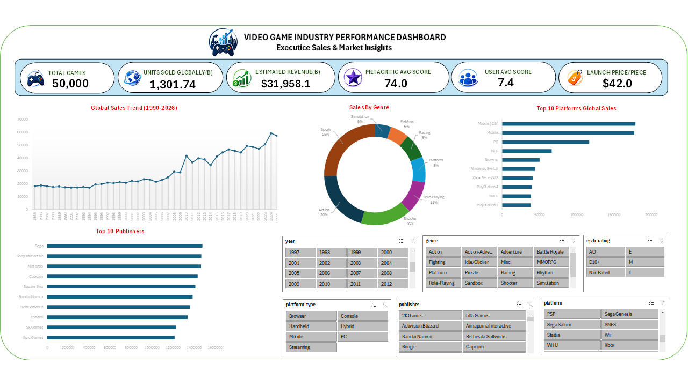
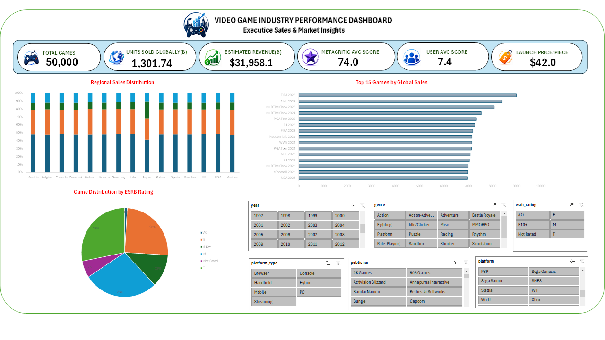

<div align="center">

# 🎮 Video Game Sales Dashboard

### Interactive Microsoft Excel Dashboard for Global Video Game Sales Analysis

<p>


</p>

Transforming raw sales data into interactive business insights using Microsoft Excel.

</div>

---

# 📚 Table of Contents

- [Overview](#-overview)
- [Dashboard Preview](#-dashboard-preview)
- [Project Objectives](#-project-objectives)
- [Dataset](#-dataset)
- [Tools & Technologies](#-tools--technologies)
- [Dashboard Features](#-dashboard-features)
- [Key Performance Indicators](#-key-performance-indicators)
- [Business Questions Answered](#-business-questions-answered)
- [Repository Structure](#-repository-structure)
- [How to Use](#-how-to-use)
- [Skills Demonstrated](#-skills-demonstrated)
- [Future Improvements](#-future-improvements)
- [Author](#-author)

---

# 📖 Overview

The **Video Game Sales Dashboard** is an interactive Microsoft Excel project that analyzes global video game sales across different platforms, publishers, genres, regions, and release years.

The dashboard transforms raw data into meaningful visualizations, helping users identify sales trends, compare performance, and explore business insights through interactive filtering.

---

# 📸 Dashboard Preview

## Dashboard Overview

<p align="center">



</p>

---

## Dashboard Insights

<p align="center">



</p>

---

# 🎯 Project Objectives

- Build an interactive Excel dashboard
- Analyze global video game sales
- Compare publisher performance
- Compare platform performance
- Analyze genre popularity
- Visualize yearly sales trends
- Present KPIs for business reporting

---

# 📂 Dataset

The project uses a video game sales dataset containing:

| Category | Description |
|----------|-------------|
| 🎮 Game | Video Game Name |
| 🖥 Platform | Gaming Platform |
| 🎯 Genre | Game Category |
| 🏢 Publisher | Publishing Company |
| 📅 Year | Release Year |
| 🌍 Sales | Regional & Global Sales |

Additional summary datasets generated during analysis include:

- Genre Summary
- Platform Summary
- Publisher Summary
- Yearly Trends

---

# 🛠 Tools & Technologies

## Software

- Microsoft Excel

## Excel Features

- Pivot Tables
- Pivot Charts
- Slicers
- Timeline Filters
- Conditional Formatting
- Data Validation
- Excel Formulas

---

# 📊 Dashboard Features

- 📌 Interactive KPI Cards
- 📈 Dynamic Pivot Charts
- 🎛 Interactive Slicers
- 🎮 Platform Analysis
- 🏢 Publisher Analysis
- 🎯 Genre Analysis
- 🌎 Regional Sales Analysis
- 📅 Year-wise Sales Trends

---

# 📌 Key Performance Indicators

The dashboard highlights important business metrics including:

- Total Global Sales
- Total Games
- Top Publisher
- Best Platform
- Best Selling Genre
- Regional Sales Distribution
- Year-wise Sales Trends

---

# 💡 Business Questions Answered

This dashboard helps answer questions such as:

- Which publisher generated the highest sales?
- Which gaming platform performed the best?
- Which genre is the most popular?
- How have sales changed over time?
- Which region contributes the most to global sales?

---

# 📁 Repository Structure

```text
video-game-sales-excel-dashboard/

│
├── Dataset
│   ├── games.csv
│   ├── genre_summary.csv
│   ├── platform_summary.csv
│   ├── publisher_summary.csv
│   └── yearly_trends.csv
│
├── Images
│   ├── Dashboard_Overview.PNG
│   └──  Dashboard_Insights.PNG
│
├── README.md
│
└── video-game-sales-excel-dashboard.xlsx
```

---

# 🚀 How to Use

1. Download the Excel workbook.
2. Open it using Microsoft Excel (2019 or later recommended).
3. Navigate to the dashboard worksheet.
4. Use the slicers to filter data interactively.
5. Explore charts, KPIs, and business insights.

---

# 🎓 Skills Demonstrated

### Data Analysis

- Data Cleaning
- Data Validation
- Data Analysis
- KPI Development

### Dashboard Development

- Dashboard Design
- Pivot Tables
- Pivot Charts
- Interactive Reporting
- Data Visualization

### Business Intelligence

- Sales Analysis
- Trend Analysis
- Performance Reporting
- Business Insights

---

# 🚀 Future Improvements

- Power BI Dashboard Version
- SQL Integration
- Automated Data Refresh
- Forecasting Dashboard
- Python Analytics Version

---

# 👨‍💻 Author

## ABHINAY REDDY TIPPIREDDY

**B.Tech – Computer Science & Engineering (Data Science)**

📊 Aspiring Data Analyst

### Connect with Me

- GitHub: https://github.com/Abhinayreddy43
- LinkedIn: www.linkedin.com/in/abhinayreddytippireddy

---

<div align="center">

### ⭐ If you like this project, consider giving it a star!

Thank you for visiting my repository.

</div>
